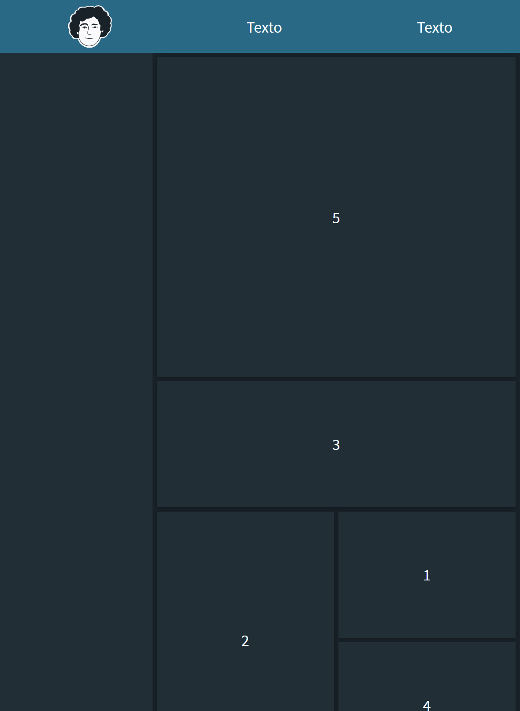
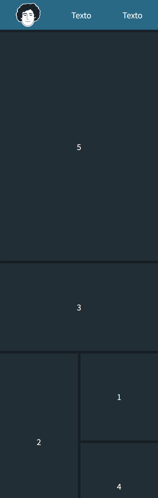

# project_layout
Proyecto con HTML y CSS (Flex y Grid)🚀
<h3 align="center">Desktop Design 💻</h3>

  </img>

<h3 align="center">Tablet Design 🍫</h3>

  </img>

<h3 align="center">Mobile Design 📱</h3>

  </img>

